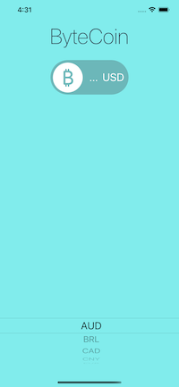

#  ByteCoin

Bitcoin price ticker. The app will give you the latest Bitcoin prices in all the popular, traded currencies, so you can track how well your Bitcoin investments are doing on the go.

* Dark-mode enabled 
* UIPikerView to select. 
* Delegate pattern.
* Swift protocols and extensions. 
* Swift closures and completion handlers.
* Use URLSession to network and make HTTP requests.
* Call API from coinapi.io
* Parse JSON with the native Encodable and Decodable protocols. 
* Use Grand Central Dispatch to fetch the main thread.

